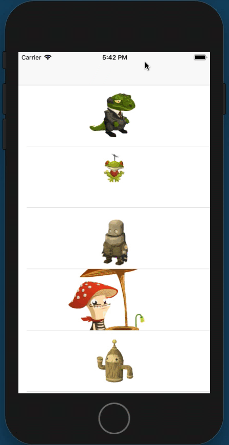

# Supplemental Module Challenge: Table View Controllers - Detailed

This challenge allows you to practice some of the concepts and techniques learned in this weeks guided lesson (as well as a few that weren't) and apply them in a concrete project. You've explored table view controllers, custom cells, segues, and detail controllers. You can demonstrate proficiency by creating an application that showcases the same features you learned in class.

## Instructions

**Read these instructions carefully. Understand exactly what is expected _before_ starting this Challenge.**

This is an individual assessment but you are permitted to consult with and support other members of your cohort. You are encouraged to follow the twenty-minute rule and seek support from your PM and Instructor in your cohort help channel on Slack. 

## Commits

Commit your code regularly and meaningfully. This helps both you (in case you ever need to return to old code for any number of reasons) and your project manager.

## Description

In this challenge, you build an interface that automatically adapts itself to portrait and landscape orientations.

Your completed application will look like the following video:



## Questions

Demonstrate your understanding of today's concepts by answering the following free-form questions. Submit them as a text file along with your project.

* What is a detail view controller?
* What does a segue do? How do you use it and where?
* What are other ways your detail view controller could get its information? Why use segues?
* Why must you conditionally cast custom cell types when using them with table views? How do you do this?
* Why must you conditionally cast detail view controller types when using them with segues? How do you do this?

## Project Setup

Follow these steps to set up your project:

1. Fork this repo and clone to your local machine.
2. Create a new iOS single view project. Delete the ViewController.swift file and the ViewController in the main storyboard.
3. Clean up the App Delegate as you like.
4. Add each talking character atlas to Assets.xcassets.

## Setting up class files

These steps help you set up the classes you'll need to use:

1. Create three new files: TableViewController.swift, TableViewCell.swift, and DetailViewController.swift. Set each one up as a class skeleton.
2. Create another file called Model.swift.

## Setting up IB

Follow these IB setup steps:

1. In Main.storyboard, add a navigation controller with an attached table view controller.
2. Set the table view controller in the storyboard to be of type `TableViewController`.
3. Set the prototype cell in the storyboard to be of type `TableViewCell`. Add a reuse identifier for it and add the same identifier as a String property to your TableViewController implementation.
4. Select the table view and set the row height to 120
5. Add an image view with Center content mode, sized 100x100. Do _not_ clip to bounds.
6. Add a detail view controller and connect it from your prototype cell by adding a segue that performs "Show".
7. Add a large label and an image view (with a centered content mode) to the detail view controller. Again, do not clip to bounds. Lay out the view to allow for the largest (vendor) animation. Otherwise you are free to design this screen as you like.

## Connecting Outlets

Make your outlet connections:

1. Connect the image view in the cell to your TableViewCell type.
2. Connect the label and the image view to your detail view controller.

## Building the Model

Add the following code to your model, and complete the missing sections. The name of each animation cell is the animation case (like `frog`)'s `rawValue` property followed by a three digit number, starting with 000.

```
import UIKit

extension Int {
    fileprivate func stringPadded(to count: Int) -> String {
        var string = String(self)
        while string.count < count { string = "0" + string }
        return string
    }
}

class Model {
    static let shared = Model()
    private init() {}
    
    enum Animation: String, CaseIterable {
        case bureaucrat = "Talking Bureaucrat"
        case frog = "Talking Frog"
        case ranger = "Talking Ranger"
        case vendor = "Talking Vendor"
        case bot = "Talking Woodbot"
    }
    
    private let cellCounts = [Animation.bureaucrat: 26, .frog: 62, .ranger: 86, .vendor: 36, .bot: 69]
    
    var characters: [Animation] {
        return Animation.allCases
    }

    func image(for character: Animation) -> UIImage {
        // RETURN THE 000 IMAGE FOR THE GIVEN CHARACTER HERE
    }
    
    func cells(for character: Animation) -> [UIImage] {
        // RETURN AN ARRAY OF IMAGES FOR THE GIVEN CHARACTER HERE
    }
}
```

## Build the Detail View Controller functionality

Add an optional `character` property and implement `viewWillAppear`, which sets the title and loads the image view with its animation. Here's how you perform UIImageView animation. You must figure out how long each animation should last at 15 frames per second. Remember to use Double arithmetic.

```
let cells = Model.shared.cells(for: character)
imageView.animationImages = cells
imageView.animationRepeatCount = 0
imageView.animationDuration = // FIGURE THIS PART OUT
imageView.startAnimating()
```

## Build the Table functionality

Implement the table view's number of rows and cell-for-row methods. Then add a prepare-for-segue method that sets the `character` property for the detail view controller.

## Minimum Viable Product

Your finished project must include all of the following requirements:

* Your table consists of centered images like the above example. Each row will be the proper height.
* Tapping on each cell leads to a detail view.
* The detail view shows a full animation at 15fps and has the correct label.
 
## Stretch Goals

After finishing your required elements, push your work further. These goals may or may not be things you learned in this module but they build on the material you just studied. Time allowing, stretch your limits and see if you can deliver on the following optional goals:

* Add a segmented control and choose the playback frames per second: 10fps, 15fps, 30fps.
* Add a play/pause button that toggles between animating and stopping the animation (`stopAnimating()`). The button label must switch appropriately between play and pause images.
* Add a share button to the detail view controller that allows you to email or otherwise share the poster image used in the table view.
